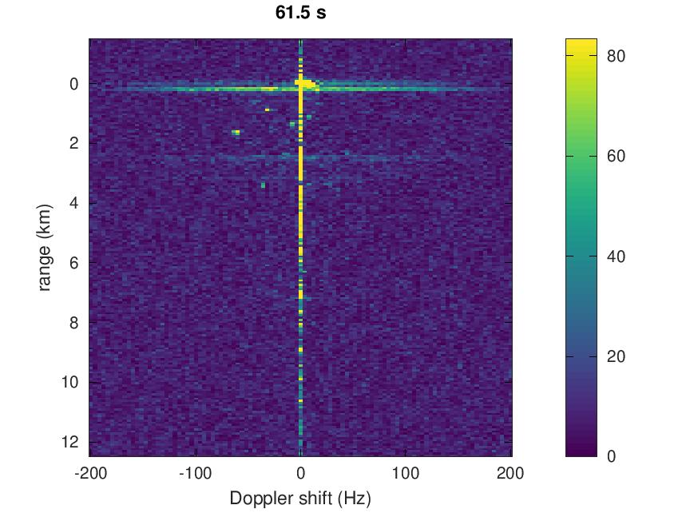
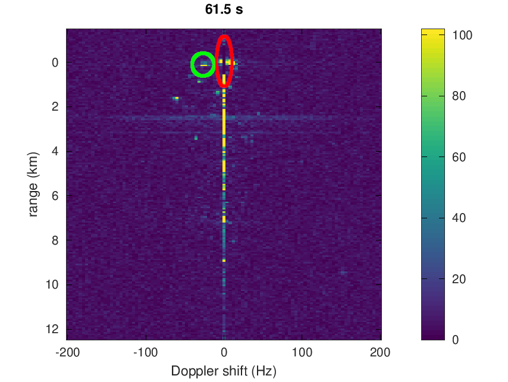

# Processing software

## Results

The dataset is huge and is stored on a separate web site at
https://www.iqengine.org under GNU Radio SigMF Repo -> Passive Radar (both channels split in
two files during post-processing although initially saved as a single interleaved file). 
This processing script for GNU/Octave assumes data have been stored as 8-bit integers.
Direct Signal Interference (DSI) removal benefit is illustrated with the figures below, 
without and with DSI removal (red ellipse) allowing for a nearby target (green
circle) to become visible, otherwise hidden in the sidelobes.




Movie of a 5.8 GB dataset processed without DSI removal (left) and with DSI removal (right)


The movies were created using

```bash
for i in `seq -w 0001 0365`; do echo $i; convert +append nodsi/${i}_2.png dsi/${i}_dsi_2.png ${i}.png;done
```
followed by
```bash
convert -delay 4 -loop 0 *dsi*.png animation_dsi.gif
```

## Executing the software

Synthetic datasets can be generated using the ``simulation.m`` script in
various formats for testing the processing software. When processing 
simulated data, uncomment the ``simulated=1;`` line in the ``goship.m``
processing software to select the right filenames and avoid skipping the
beginning of the dataset.

The ``goship.m`` can be tuned for various input formats: change the ``
``datatype='int8'`` line to int16, int32 or float accordingly. For sampled
data, make sure to set the sampling rate accordingly with ``fs=2.048e6;``.
The Doppler shift range ``freq=[-200:4:200];`` is a tradeoff between fine
motion detection (small steps) and processing duration (large steps). 
Remember that the RADAR Doppler shift is $f_D=2\cdot f_c\cdot v/c$ since
the wave reaches the target twice upon reflection. At $f_c=500$ MHz carrier
frequency, a $f_D=\pm 200$ Hz is a velocity of $\pm 60$ m/s or $\pm 216$ km/h.
Direct Signal Interference (DSI) suppression is time consuming but will
enhance short range target detection: activate by setting ``dsi_suppression=0``.
On the proposed dataset, the beginning of the files do not hold useful 
information and is skipped with ``fseek(f1,1008*N);``: remove to start
processing from the beginning of the file.
