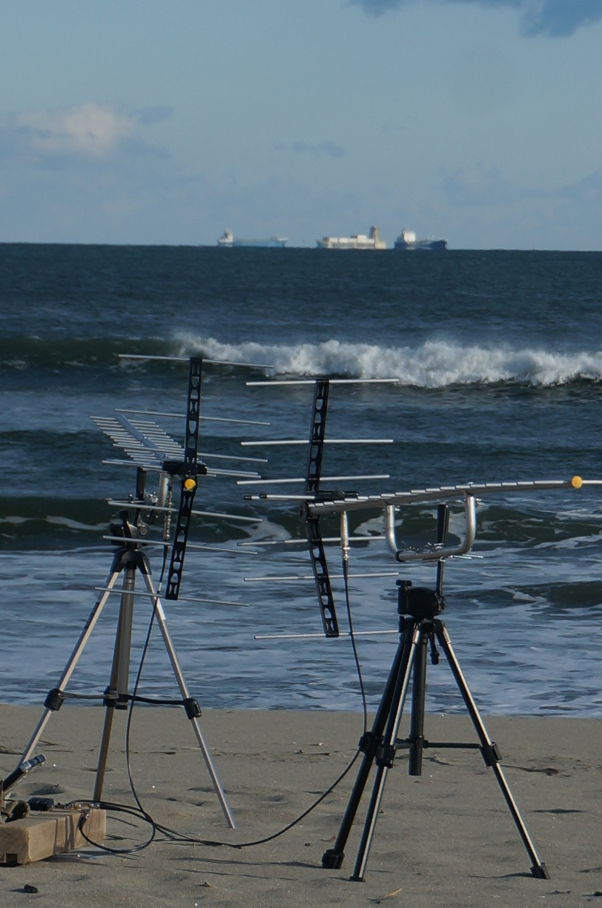

# passive_radar
Passive radar measurements using synchronized RTL-SDR DVB-T receivers

Two DVB-T receivers were clocked from the same reference and data collected at
2.048 MS/s with one antenna facing the reference signal of a DVB-T emitter in Sendai, Japan,
and the other Yagi-Uda antenna facing the target. The samples are collected as interleaved
complex floating point numbers.

See [the 2018 FOSDEM presentation](https://archive.fosdem.org/2018/schedule/event/passiveradar/) 
for a description of the experiment

# GNU Radio flowchart

The GNU Radio flowchart is limited to two RTL-SDR sources provided by the OsmoSDR Source 
(``gr-osmosdr`` package in Debian GNU/Linux) whose output is interleaved and stored in a
file. Be aware of the huge file size resulting from running this flowchart: at 2.4 MS/s, 32-bit
float, two complex channels the datarate is 38.4 MB/s or 2.3 GB/minute. Post-processing involves
running the cross-correlation between both channels for all possible frequency offsets introduced
by moving targets.

In case multiple azimuths are considered, the dataflow must *never* between acquisitions or
a random delay from the USB bus will be introduced from one acquisition to the next. The 0MQ
Publish/Subscribe mechanism allows for continuously running the RTL-SDR stream while connecting
the subscribe source to a file only when the new azimuth has stabilized.
